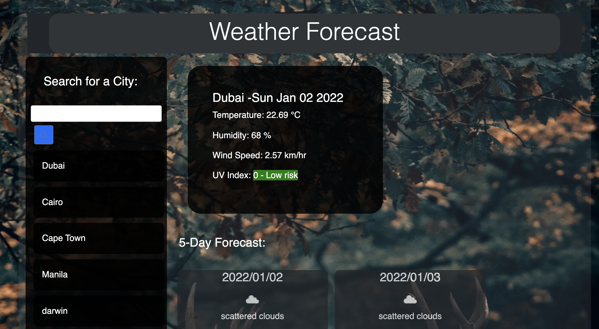

# openWeatherApi## Purpose:
    Openweathermap.org has a server-side api that allows you to get information about the weather 

## Built With:
    - HTML
    - CSS 
    - Javascript 
    - Jquery 
    - Bootstrap
    

## Description: 

    This api gives you weather forecast (e.g. Temperature, Humidity, Wind Speed, UV Index) and also it includes a 5 day weather forecast.
    The UV index it includes the risk level. 
    

    

## Website:

    https://idjh263.github.io/openWeatherApi/
## Contribution: 

    Made by Irene Hipolito 🤪 with the help TA's, instructor @Trilogy, github pages and GOOGLE. 

